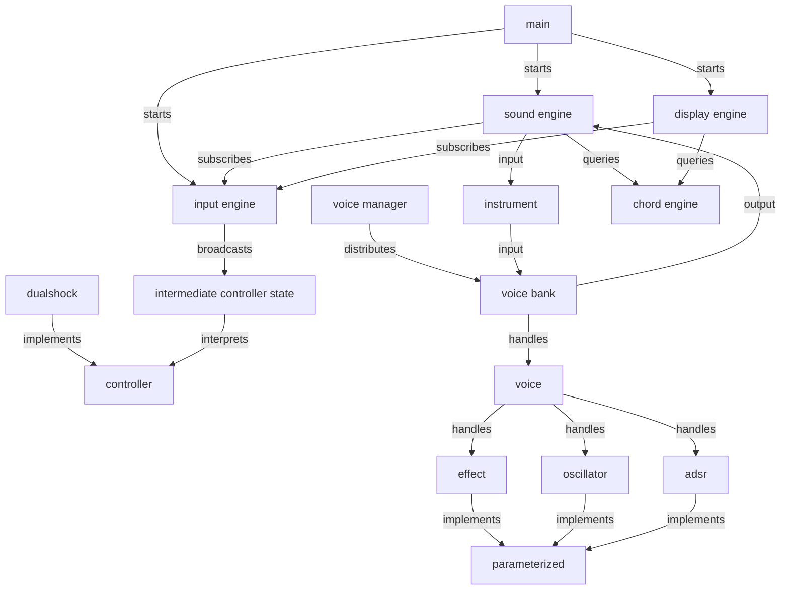

# Controller Synth

Rust app that allows control over a realtime synth/audio engine with a PlayStation 4 Dualshock controller

## What is This?

There's a number of synths I've thought are really cool for a while but couldn't justify the price of, particularly:

- **The HiChord** – a tiny box with only 7 keys (as in Western music theory each key has 7 unique notes and 7 corresponding chords) and a joystick. Each key plays a chord and the joystick modifies the chord being played (for example by flipping what would be a minor chord to a major or visa versa). This was the primary inspiration behind using a controller – the main special thing about the HiChord is that it has a joystick, well mine has two!
- **The OmniChord** – a ~laptop sized hunk of plastic resembling an autoharp with 38 keys and a little touch-sensitive single-axis pad. Pressing a button drones the root note of that chord and sliding across the pad strums notes contained in that chord (across multiple octaves)
- **The OP-1** – a computer-keyboard-sized box resembling a normal MIDI keyboard but with lots of extra knobs and buttons and a tiny screen in the top left corner. The OP-1 has lots of fun little features, but that screen is what really makes it fun, the visuals and UI are responsive, colorful, and always playful

I initially wrote a prototype in ToneJs, but decided I wanted more control over the synth's sound, access to my controller's OmniChord-like touchpad (which is not covered by any controller APIs I could find and the reason I decided to use this controller), and access to the raw audio data for oscilliscope-like visuals. Before this project I had no experience with ground-up DSP / sound creation, handling raw device input, and barely any experience with Rust.

## Architecture

The general 'boxes' / abstractions:

- display engine handles all visual output
- sound engine handles all sound output
  - instruments define how effects, adsrs, oscillators, and inputs should be assembled into a voices and a controlling voicebank
  - voicebanks take and distribute input note events and output raw sound data (effects are applied on this level)
    - voices handle a single oscillator and adsr
    - effects, adsrs, and oscillators are paramaterized, meaning they can be modified by input events
- input engine handles all input
- chord engine handles definitions of all music theory related constants and functions

> This rest section was written by Claude

Controller input flows through a pipeline of modules:

- [`dualshock.rs`](src/dualshock.rs) / [`controller.rs`](src/controller.rs) — reads raw HID reports from the DS4 over `hidapi` and parses them into an [`IntermediateControllerState`](src/intermediate_controller_state.rs).
- [`intermediate_controller_state.rs`](src/intermediate_controller_state.rs) — diffs successive states into discrete `InputEvent`s (button presses, stick regions, trigger values).
- [`input_engine.rs`](src/input_engine.rs) — runs the controller-read thread and broadcasts `InputEvent`s to subscribers (sound + display).
- [`sound_engine.rs`](src/sound_engine.rs) — consumes input events, drives [`chord_engine.rs`](src/chord_engine.rs) (key/scale/chord-mode music theory) to decide which notes to play, and dispatches play/release calls to `Instrument`s.
- [`instrument.rs`](src/instrument.rs) — wires an [`Oscillator`](src/oscillator.rs) and [`Adsr`](src/adsr.rs) envelope per voice through a chain of [`Effect`s](src/effect.rs) (delay, gain, noise), with controller inputs mappable to any parameter. [`voice_manager.rs`](src/voice_manager.rs) allocates/steals voices for polyphony. [`parameters.rs`](src/parameters.rs) provides a macro for declaring settable, ranged parameters on oscillators/envelopes/effects.
- [`sound.rs`](src/sound.rs) — sets up the `cpal` audio output stream and pulls samples from the `SoundEngine` each callback.
- [`display_engine.rs`](src/display_engine.rs) / [`visuals.rs`](src/visuals.rs) — renders the waveform and chord/key UI via raylib.

## Next Steps

- Improve visuals
- Add UI to change instruments and control unmapped effects
- Reverb `Effect`s
- Wavetable `Oscillator`
- Chord looping
- Arpegiator + sequencer
- LFOs (that control parameters)
